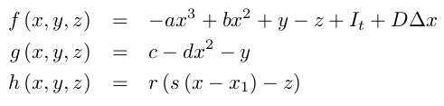
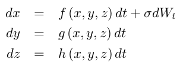

# Hindmarsh-Rose lattice model in *Python* and *julia*

This repo contains implementations of the Hindmarsh-Rose model of neuronal excitability on a 2D lattice.  
The code is available in Python and Julia.  

**Ref.:** Hindmarsh, J.L., Rose, R.M., A model of neuronal bursting using three coupled first order differental equations. __*Proc R Soc Lond B*__ 221:87-102, 1984.

**Rendered page:** https://frederic-vw.github.io/hindmarsh-rose-2d/

**_Python_ Requirements:**
1. [python](https://www.python.org/) installation, latest version tested 3.6.9
2. python packages (`pip install package-name`)
  - NumPy
  - Matplotlib
  - opencv-python (save data as movie)

**_Julia_ Requirements:**
1. [julia](https://julialang.org/) installation, latest version tested 1.6.1
2. julia packages (`julia > using Pkg; Pkg.add("Package Name")`)
  - NPZ
  - PyCall (load Matplotlib animation functionality)
  - PyPlot
  - Statistics
  - VideoIO (save data as movie)

## Hindmarsh-Rose model

The Hindmarsh-Rose model uses three variables to model membrane potential dynamics in response to current injections. The model is an extension of the FitzHugh-Nagumo model. The third variable of the Hindmarsh-Rose model implements slow inactivation dynamics of the membrane potential and allows to model neuronal bursting. 
Spatial coupling is introduced via diffusion of the voltage variable ($D \Delta V$):

Noise is added via stochastic integration of the variable $x$:

The main function call running the simulation is: `hr2d(N, T, t0, dt, sd, D, a, b, c, d, s, r, x1, I0, stim, blocks)`:  
- `N`: lattice size `(N,N)`
- `T`: number of simulation time steps
- `t0`: number of 'warm-up' iterations
- `dt`: integration time step
- `sd`: noise intensity (&sigma;)
- `D`: diffusion constant
- `a,b,c,d,s,r,x1`: Hindmarsh-Rose model parameters, `I0`: stimulation current amplitude
- `stim`: stimulation current parameters, array of time-, x-, and y-interval borders
- `blocks`: conduction blocks, array of x- and y-interval borders

**Outputs:** `(T,N,N)` array as NumPy .npy format and as .mp4 movie.

In example 1, use
- `stim = [ [[0,15000], [5,N-5], [5,N-5]] ]`
- `blocks = []`
(works in Python, in Julia change 0 to 1)

### Example-1
Stimulation of a large block of the simulation area generates a depolarization in that area in which different wave patterns develop, including spiral waves.
Parameters:  
`N = 64, T = 15000, t0 = 2500, dt = 0.05, sd = 0.05, D = 2.0, a = 1.0, b = 3.0, c = 1.0, d = 5.0, s = 4.0, r = 0.001, x1 = -1.6, I0 = 3.5`

<video src="videos/hr2d_I_3.50_s_2.00_sd_0.05_D_2.00.webm" width="256" height="256" controls preload></video>

### Conclusions
The Hindmarsh-Rose lattice model can produce multiple wave patterns.
